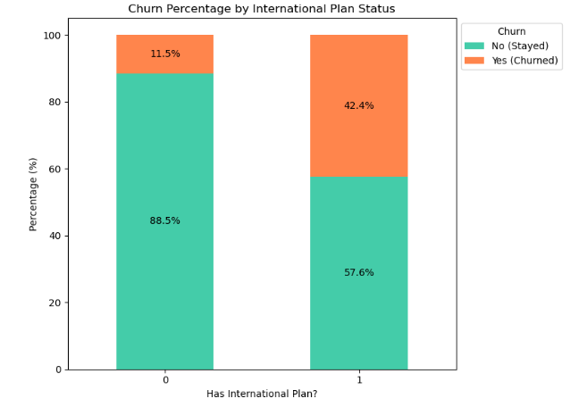
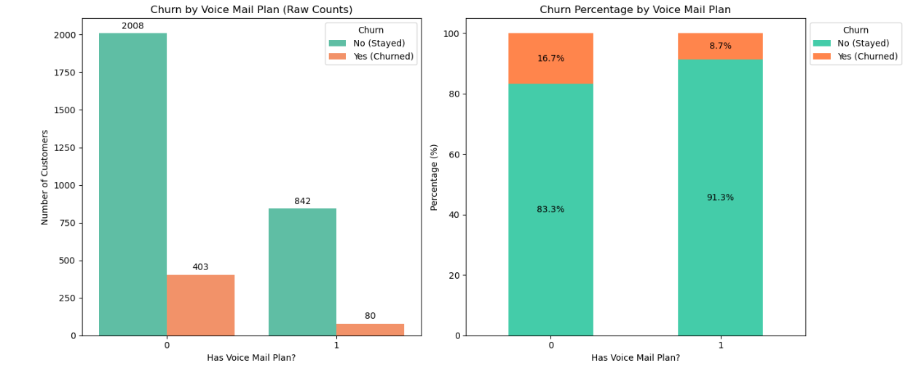
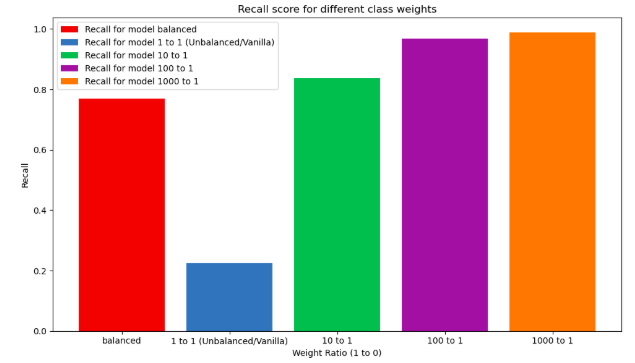
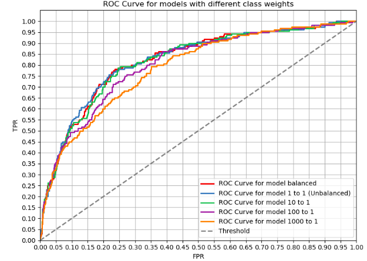
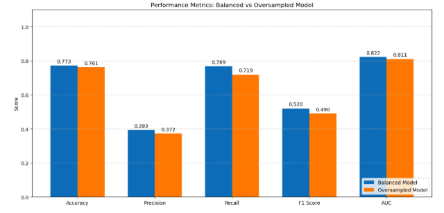
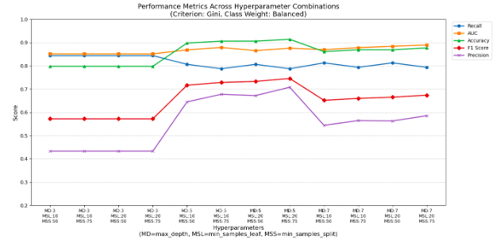
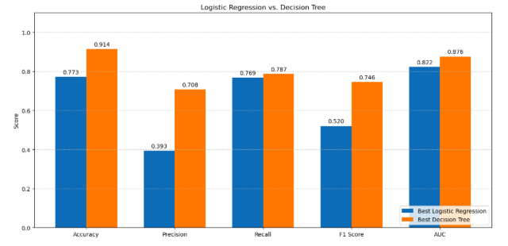

---
<h1 align='center'>
SYRIATEL CHURN ANALYSIS
</h1>

> **Author**: Ngundo Muithya

> **Email**: ngundolarrymuithya@gmail.com

<h2 align='center'>
1. INTRODUCTION
</h2>

### Overview

SyriaTel is a leading Syrian mobile telecommunication company established in the year 2000, headquartered in Damascus, providing GSM and LTE services

SyriaTel is interested in predicting whether a customer will churn (stop working with the company) or not.

I will create a predictive model that will help determine if a customer will churn or not.

I will do this by using the publicly available SyriaTel customer information (stored [here](./Data/syriatel_data.csv)) on churning to create two models: a **logistic regression model** and a **decision tree** and use model evaluation to determine which is better at predicting whether or not a customer will churn.

### Business Understanding

The business objectives are:
* Create a model that reliably predicts whether or not a customer will churn
* Identify the attributes that are most likely to cause churning
* Develop recommendations on how to limit churning

I will focus on two types of classifiers: **logistic regression models** and **decision trees**

<h2 align='center'>
2. DATA UNDERSTANDING
</h2>

I will use the publicly available data on churning provided by SyriaTel [here](./Data/syriatel_data.csv)

It contains various information about customers, including whether or not they will churn.

A descriptive definition of the columns is located [here](./Data/SyriaTel_Dataset_Feature_Dictionary.txt)

### Exploratory Data Analysis

I discovered that the data contained no empty or duplicate values.

I performed data cleaning and did some visualization:

#### Churn Percentage by International Plan Status

88% of those without international plans stayed while only 57% of those with international plans stayed.

#### Churn Distribution by Voice Mail Plan

A customer with a voice mail plan is less likely to churn compared to one without a voice mail plan although they are both more likely to stay.

<h2 align='center'>
3. MODEL BUILDING
</h2>

### a) Logistic Regression

I determined the dataset had class imbalance

I built two logistic models: one **using class weights** and another **using SMOTE** and compared the two to get the best one.

#### i) Using Class weights

##### Recall scores for logistic models using different class weights

##### ROC Curves for logistic models using different class weights

From this, I determined the best model was the one with a `class_weight` of **balanced**.

#### ii) Using SMOTE

I then used SMOTE on the training data to get oversampled training data that I used to train an **oversampled** model. I then compared the oversampled model to the balanced model.

##### Balanced vs Oversampled Models

I determined the **best logistic model** of the two was the **balanced model**

### b) Decision Tree

I built a vanilla decision tree and did hyperparameter tuning and pruning to improve its performance.

#### Hyperparameter Tuning and Pruning

I determined the best hyperparameters to use that improved the **recall** and overall performance of the decision tree model were:

* `criterion`:  **gini**
* `class_weight`:  **balanced**
* `max_depth`: **5**
* `min_samples_leaf`: **20**
* `min_samples_split`: **75**

I used these to build the **best decision tree model**.

<h2 align='center'>
4. MODEL SELECTION
</h2>

I compared the **best logistic model** and the **best decision tree** to determine the **best overall model**.

### Best Logistic Model vs Best Decision Tree

I determined that the **decision tree** was the **better** model.

<h2 align='center'>
5. CONCLUSION
</h2>

The better classification model to use is the **best decision tree**. It has better **recall** compared to the **best logistic model** and performs better in all other categories.

<h2 align='center'>
6. RECOMMENDATIONS
</h2>

### a) Model Recommendations

Use the decision tree for **prediction** and the logistic regression model for **inference** 

### b) Business Recommendations

* Lower the price of an international plan

* Streamline customer service operations

* Offer voice mail plans to more customers

<h2 align='center'>
7. NEXT STEPS
</h2>

* Perform **cross-validation** to see how the models perform using different training and test sets

* Play around with combinations of other hyperparameters to see if they improve performance.

<h2 align='center'>
8. FOR MORE INFORMATION
</h2>

For more information see the [Jupyter Notebook](./notebook.ipynb) and the [Presentation](./presentation.pdf)